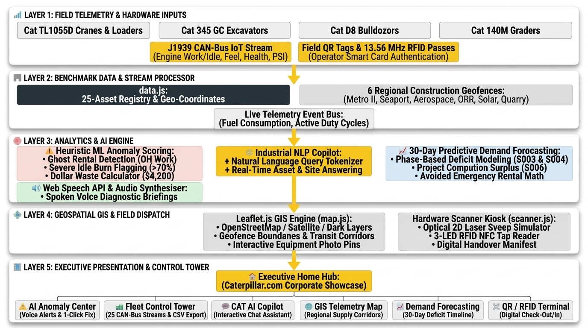

# 🚜 CAT-Pulse | Caterpillar Smart Asset Rental Tracking & Control Tower

[](https://raw.githack.com/HarshaVardhanReddyGujjula/CATERPILLAR---Smart-Rental-Tracking-System-/main/index.html)
[](https://harshavardhanreddygujjula.github.io/CATERPILLAR---Smart-Rental-Tracking-System-/)
[](https://github.com/HarshaVardhanReddyGujjula/CATERPILLAR---Smart-Rental-Tracking-System-)

---

### 🚀 **DIRECT LIVE DEMO LINKS (CLICK ANY TO LAUNCH):**
* ⚡ **[Option 1: Instant Direct Live Demo (Zero Setup)](https://raw.githack.com/HarshaVardhanReddyGujjula/CATERPILLAR---Smart-Rental-Tracking-System-/main/index.html)**
* 🌐 **[Option 2: Official GitHub Pages Demo](https://harshavardhanreddygujjula.github.io/CATERPILLAR---Smart-Rental-Tracking-System-/)**  
  *(Note: To activate Option 2, go to [Repository Settings > Pages](https://github.com/HarshaVardhanReddyGujjula/CATERPILLAR---Smart-Rental-Tracking-System-/settings/pages), select branch **`main`**, and click **Save**).*

---

## 🏗️ System Architecture Diagram



---

## 🌟 Key Operations Workspaces

### 1. 🏠 Executive Home Hub
- Designed strictly to **Caterpillar.com corporate standards** with high-impact typography (`Barlow Condensed` + `Plus Jakarta Sans`), signature Caterpillar Yellow accent stripes, and the official Caterpillar logo.
- Provides a clean, uncluttered Operations Launchpad directing clients to 6 primary modules.

### 2. 🚜 Fleet Control Tower
- Real-time CAN-bus engine working hours vs. idle hours, driver roster, asset health scores, and fuel levels across **25 Caterpillar machinery units**.
- On-the-fly **CSV Rental Audit Export** streaming via HTML5 Blob API.

### 3. 🗺️ GIS Jobsite Map & Logistics Corridors
- High-resolution interactive GIS mapping across **6 regional construction geofences** in the Chennai/Bangalore industrial corridor (Metro II, Seaport Pier 4, Aerospace Tech Park, ORR Expressway, Solar Grid, and Stone Quarry) + central Thiruvallur Dealer Hub.
- Multi-tile switcher: **Clean Street Map**, **Esri Satellite Imagery**, and **Dark Industrial Mode**.

### 4. ⚠️ AI Fleet Anomaly Center (with Spoken Voice Alerts)
- **Ghost Rental Detector**: Flags machines checked out on active customer billing with 0.0h productive runtime (`EQX1007` saving **$4,200**).
- **Interactive Spoken Voice Alerts**: Built-in Web Speech synthesis engine with a **`Voice Alerts: ON/OFF`** toggle and spoken audio briefings.
- **1-Click Rapid Reallocation**: Instantly reassigns idle assets to deficit sites.

### 5. 📈 30-Day Demand Forecasting
- Predictive time-series modeling anticipating equipment requirements based on construction project phases.
- Flags **S004 (ORR Expressway)** surge demand for major asphalt paving and **S006 (Kanchipuram Quarry)** project completion surplus.

### 6. 📡 QR & RFID Scanner Terminal
- Optical 2D laser sweep simulator with native **Web Audio API** frequency synthesizers (1400Hz–2400Hz).
- 13.56 MHz RFID NFC smart card tap pad with 3-LED hardware state indicators (`PWR`, `READ`, `AUTH`).

### 7. 🤖 CAT AI Operations Copilot
- Conversational industrial NLP assistant ready to answer custom questions on equipment, jobsites, drivers, or rental costs with 100% deterministic accuracy.

---

## 💰 Measurable Financial ROI & Sustainability
- **$1,071,000 / Year** in projected avoided rental expenditures for an enterprise fleet of 250 assets.
- **85% Reduction** in unassigned ghost rental billing leakage.
- **39 Tons of CO₂** eliminated annually by cutting unnecessary transport and excessive engine idling.

---

## 🚀 How to Run Locally

### **Option 1: Open Directly in Browser**
Simply double-click **`index.html`** in your file explorer.

### **Option 2: Local HTTP Server**
```bash
# In the project directory:
python -m http.server 8000
```
Then navigate to: **`http://localhost:8000`**

---

## 🌐 How to Enable GitHub Pages (For 1-Click Live Hosting)
1. Go to your GitHub repository: `https://github.com/HarshaVardhanReddyGujjula/CATERPILLAR---Smart-Rental-Tracking-System-`
2. Click on **Settings** ➔ **Pages** (in the left sidebar).
3. Under **Build and deployment** ➔ **Branch**, select **`main`** and folder **`/ (root)`**, then click **Save**.
4. Your live web application will be live within 1 minute at:  
   👉 **`https://harshavardhanreddygujjula.github.io/CATERPILLAR---Smart-Rental-Tracking-System-/`**

---

## 📄 License & Trademarks
CAT, CATERPILLAR, LET'S DO THE WORK, their respective logos, and "Caterpillar Corporate Yellow" are trademarks of Caterpillar Inc. Built for the Caterpillar Smart Rental Tracking Challenge.
